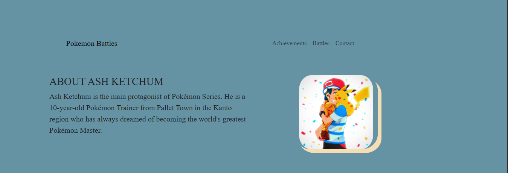

# ⚔️ Pokémon Battles — Fan Tribute Site

A fan-made, interactive web page showcasing Ash Ketchum’s legendary battles, achievements, and career highlights from the Pokémon series. Built with **Bootstrap 5** and **Font Awesome**, this lightweight site offers a playful interface with videos, image slideshows, and Ash’s badge collection journey.

---

## 🌐 Live Demo

🚀 [Check it out here!](https://rajveer-singh8124.github.io/Ash-vs-Cynthia/)

---

## 📸 Preview

---

## ✨ Features

- 📖 **About Ash Ketchum** — Brief story of Ash and his ambition to become the greatest Pokémon Master.
- 🏆 **Achievements Section** — Showcasing badges earned and league results throughout the regions.
- 🎥 **Interactive Battle Carousel** — Video highlights and summaries of iconic Ash vs Cynthia battles.
- 📫 **Contact Section** — Social media icons (GitHub, Email) and copyright.

---

## 🛠️ Built With

- **HTML5**
- **CSS3**
- **Bootstrap 5**
- **Font Awesome 5**
- **JavaScript**

---
